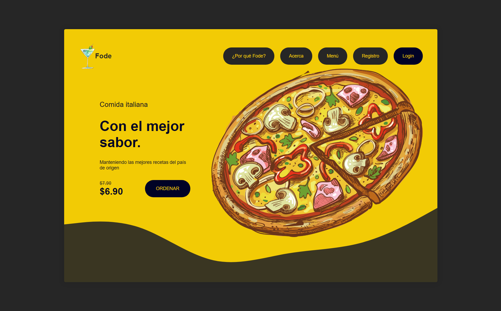

# PRIMER SITIO WEB CON SASS

PAgina ehca de un curso completo para crear tu primer sitio web usando SASS. Aprendiendo los conceptos más importantes y creaando un sitio, reusando estilos.

- Ver Pagina: [Link](https://sergio-ivan-melgarejo.github.io/sass-primer-sitio-web/)

